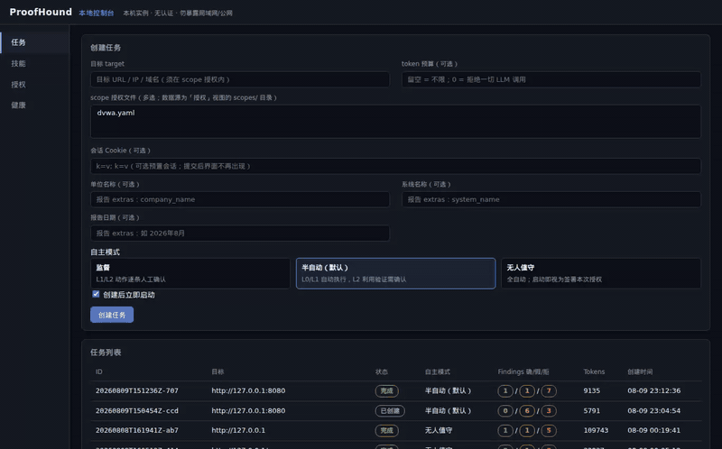

# ProofHound

**证据驱动、验证优先的自动化渗透测试 Agent 系统。** 一切候选发现默认为假，必须通过行为验证、证据门与独立 Verifier 终审才能进入报告。

名称说明：本项目与 proofhound.org 的提示词管理平台没有任何关系，纯巧合撞名；PyPI 包名 proofhound 为本项目预留。



核心差异化：

- **证据门控反误报**：候选发现走 Signal→Hypothesis→Reproduced→Confirmed 状态机；版本匹配型 CVE、纯状态码型发现被铁律硬编码永久禁止 Confirmed；证据门（`verify/gate.py`）+ Verifier（独立模型对抗校验）双层防守。
- **出处可调出**：每条 Finding 配证据包（原文 + sha256 manifest + 行号锚点），`python -m proofhound.findings show <id>` 纯文件离线调出，不碰网络/LLM。
- **预算硬闸**：Run 级 token 预算调用前检查，超限即停并记审计，与 scope 授权同级不可绕过；LLM 三档路由（T0 廉价/T1 中档/T2 前沿），Verifier 以独立 agent 对抗校验——输入被硬性限制为结构化摘要与证据索引，看不到发现端的推理链；独立性来自隔离而非模型差异，T1/T2 可同模型。
- **授权先行**：无 scope 授权文件系统拒绝启动；每条拟执行命令先提取目标过 scope 校验，越界拒绝 + 记审计。
- **模板化报告**：docx 模板（docxtpl）一键出报告；事实字段全部来自结构化数据，LLM 只做叙述润色且段落必须锚定 Finding ID，另有确定性叙事事实守卫校验状态措辞与计数。
- **发现侧不靠关键词表**：参数名不在内置提示表内的真实漏洞（`article_id` / `sku` / `ref` / 中文站 `bh` 等），纯规则表**根本不产生候选**——不是验证失败，是看不见。T1 档**模型驱动假设生成**补上这一层，并在 `scripts/bench_triage.py` 的中性基准上用三臂消融量化：纯规则表发现率 **33.3%** → 接入模型 **100%**（详见下「发现效果基准」）。

## ⚠️ 法律免责声明

**本工具仅用于获得书面授权的安全测试。** 未经授权对任何系统使用本工具（扫描、验证、利用）在绝大多数司法辖区属违法行为。使用者须自行确保拥有目标系统的有效书面授权，并对使用本工具产生的一切后果承担全部责任。作者不承担任何直接或间接责任。下载、安装或使用本工具即视为接受本声明。

## 架构五条红线

实现与本仓库一切贡献均受以下红线约束（详见 [docs/design.md](docs/design.md) §3）：

1. **LLM 只做推理**：确定性动作由调度器直接执行；LLM 规划输出结构化 JSON，不直接生成 shell 命令（命令由工具管理器按 manifest 模板拼装）。
2. **发现 ≠ 漏洞**：候选发现默认是假的，必须经行为验证晋级 Confirmed。
3. **上下文只进结构化摘要**：工具原始输出一律落盘 `evidence/`，LLM 上下文只有结构化数据 + 文件引用路径。
4. **模型按任务分级 + 校验独立性**：解析/润色用廉价模型，漏洞假设与 Verifier 用前沿模型；**校验独立性**——Verifier 在独立 agent、独立上下文中运行，输入仅限结构化摘要与证据索引，**模型身份不作约束**（T1/T2 可同模型）。
5. **授权前置**：scope 强制校验、预算帽、append-only 审计日志在任何自治模式下都不可绕过。

## 定位与边界

**ProofHound 不是又一个漏洞扫描器。** 扫描器输出的是"可能存在"——数千条特征签名筛出的 Potential 列表，真假交人工复核；ProofHound 输出的是"已行为确认 + 证据链"——每条 Confirmed 都经行为复现、证据门与独立模型对抗终审，附带可离线调出的完整证据包。

当前的刻意取舍：

| 维度 | ProofHound | 传统扫描器 |
|---|---|---|
| 漏洞类型覆盖 | 少而精：只做能行为确认的类型（当前 SQL 注入、XSS、IDOR/水平越权三条验证切片） | 数千条特征签名，广而浅 |
| 输出语义 | Confirmed 即铁证：行为验证 + 证据链 + Verifier 终审 + CVSS 代码算分 | Potential 待人工，误报率自担 |
| 发现面 | Web 应用层（katana 爬行带参端点 + POST 表单页 + **JS 文件内端点**，M16-a） | 主机/端口/服务/全协议 |
| 误报治理 | 多道闸：triage 启发式宁漏勿滥 → 行为验证 → 证据门 → Verifier 对抗校验 | 主要靠特征精度 |

覆盖广度沿路线图渐进扩展，但纪律不变：**新漏洞类型必须先过"能否行为确认"这一关**——不能行为确认的宁可不做，绝不为凑覆盖率引入"疑似即确认"的降级路径。

## 三分钟看清 ProofHound

最短路径只需一个目标——**不必手写 scope 文件**：系统从目标自动派生授权范围（只从该 host 派生、不跟随重定向、不扩张；通配符/裸 TLD/全网段一律拒绝），并要求你显式确认已获授权（派生是技术动作，授权是你的确认，两者分开留痕）。沙箱出口默认 `restricted`，其白名单就是这个派生范围。

一条命令（`scripts/demo_killer.py`，见 Quickstart）：单 engagement 覆盖 DVWA（sqli + xss_r）与内置 IDOR fixture 双目标，katana 爬行自动产出 **21 条候选**，L2 确认队列按白名单**批准 4 条、拒绝 17 条**，最终 **3 个 Confirmed + 1 个对照 REJECTED**（证明不误报），scan→verify 全程 287 秒。以下为一次真实运行的脱敏结果：

| 漏洞类型 | asset 形态 | 确认方法 | CVSS | 证据文件构成 |
|---|---|---|---|---|
| SQL 注入 | `127.0.0.1:8080/vulnerabilities/sqli/?id=1` | `sqlmap-confirmed`（沙箱 sqlmap 行为确认，4 种注入技术交叉） | 4.3 | katana 出处 + 带会话 baseline + sqlmap stdout（共 3 项） |
| 反射型 XSS | `127.0.0.1:8080/vulnerabilities/xss_r/?name=1` | `browser-confirmed`（无头 Chromium canary 脚本执行事件） | 5.4 | katana 出处 + baseline + canary 事件 JSON + DOM 快照 + console + 请求链（共 6 项） |
| IDOR/水平越权 | `127.0.0.1:<fixture>/invoice?id=1001` | `dual-session-confirmed`（双会话属性违反，正文相似度 0.965） | 4.3 | katana 出处 + 双会话响应原文 + 判定 JSON（共 4 项） |

对照组 `/invoice?id=1002`（有授权判断）：B 会话 200 / A 会话 403，判定不成立 → **REJECTED**，同报告误报附录可查。三条 Confirmed 的 CVSS 均为 Verifier 出向量、代码按官方公式算分；每条证据包带 sha256 manifest 与行号锚点，可离线调出。

真实审计链摘录（节选自真实运行 `audit.jsonl`，2026-08-14；凭据已是 `sha256:` 标记脱敏形态，长命令行以 `…` 省略尾部参数）：

```jsonl
{"ts": "2026-08-14T18:39:55Z", "event": "command_executed", "tool": "katana", "command": ["katana", "-u", "http://127.0.0.1:39231", "-H", "Cookie: sha256:43ea4ef3", "-d", "2", "-c", "5", "-jsonl", "-silent", "-nc", "-fs", "rdn", "…"], "exit_code": 0}
{"ts": "2026-08-14T18:40:57Z", "event": "command_executed", "tool": "sqlmap", "command": ["sqlmap", "-u", "http://127.0.0.1:8080/vulnerabilities/sqli/?id=1&Submit=Submit", "--cookie", "sha256:43ea4ef3", "-p", "id", "--level", "1", "--risk", "1", "--batch", "…"], "exit_code": 0}
{"ts": "2026-08-14T18:41:37Z", "event": "verifier_verdict", "finding_id": "F-2026-0005", "model": "kimi-k3", "verdict": "confirm", "cvss_vector": "CVSS:3.1/AV:N/AC:L/PR:L/UI:N/S:U/C:L/I:N/A:N"}
{"ts": "2026-08-14T18:41:37Z", "event": "verify_completed", "skill": "verify-sqli", "processed": 1, "confirmed": 1, "rejected": 0, "blocked": 0, "skipped": 11}
{"ts": "2026-08-14T18:42:10Z", "event": "xss_probe_attempt", "finding_id": "F-2026-0008", "seq": 1, "token": "phxss_23149902eb12", "canary": true, "event_types": ["marker"]}
{"ts": "2026-08-14T18:42:38Z", "event": "verifier_verdict", "finding_id": "F-2026-0008", "model": "kimi-k3", "verdict": "confirm", "cvss_vector": "CVSS:3.1/AV:N/AC:L/PR:L/UI:R/S:C/C:L/I:L/A:N"}
{"ts": "2026-08-14T18:42:40Z", "event": "action_approved", "action": "verify-idor", "risk_level": "L2", "finding_id": "F-2026-0004", "operator": "demo-operator"}
{"ts": "2026-08-14T18:42:52Z", "event": "idor_probe_attempt", "finding_id": "F-2026-0002", "role": "reference", "status": 200}
{"ts": "2026-08-14T18:42:52Z", "event": "idor_probe_attempt", "finding_id": "F-2026-0002", "role": "attacker", "status": 403}
{"ts": "2026-08-14T18:42:52Z", "event": "idor_probe_attempt", "finding_id": "F-2026-0004", "role": "attacker", "status": 200}
{"ts": "2026-08-14T18:43:43Z", "event": "verifier_verdict", "finding_id": "F-2026-0004", "model": "kimi-k3", "verdict": "confirm", "cvss_vector": "CVSS:3.1/AV:N/AC:L/PR:L/UI:N/S:U/C:L/I:N/A:N"}
{"ts": "2026-08-14T18:44:52Z", "event": "report_built", "template": "default_template.docx", "narrative": true, "out": "report.docx"}
```

报告样例见占位图，运行 `scripts/demo_killer.py` 可复现（每条 Confirmed 在报告中带四段式证据结构：claim/method/expected/actual）：


## Quickstart：十分钟复现（DVWA 全流程）

目标：全新机器从零 → DVWA 靶场 → 创建任务 → 批准 L2 → Confirmed → 出报告。

前提：Linux（WSL 亦可）+ 可用 Docker 守护进程 + Python 3.12 + 一组 OpenAI 兼容 LLM API key（T1、T2 两档；**可用同一模型**，独立性由 agent 隔离保证，建议至少不同模型家族以降低共享盲点）。

```bash
# 1. 获取代码与依赖
git clone <仓库地址> proofhound && cd proofhound
python3.12 -m venv .venv
.venv/bin/pip install -r requirements.txt                     # 完整依赖锁（可复现）
.venv/bin/pip install -e . --no-deps --no-build-isolation
# 不锁版本亦可：.venv/bin/pip install -e ".[dev]"（按 pyproject 的 >= 解析）

# 2. 配置 LLM：复制样例并填入 T1/T2 两档（T0 可选）
cp .env.example .env
vi .env            # 填 PROOFHOUND_T1_* 与 PROOFHOUND_T2_*

# 3. 起 DVWA 靶场容器（同名旧容器先清理：docker rm -f dvwa 2>/dev/null）
docker run -d --name dvwa -p 8080:80 vulnerables/web-dvwa

# 4. 写 scope 授权文件（无授权不启动；scope 目录本机私有、不入库）
mkdir -p scopes
printf 'networks: [127.0.0.0/8]\nports: [8080]\n' > scopes/dvwa.yaml

# 5. 起本机控制台（只绑 127.0.0.1；8000 被占用时换 --port 8001，浏览器地址相应替换）
#    浏览器会弹 HTTP Basic 登录框：默认 shangyun / 123456（改口令见 .env）
.venv/bin/python -m proofhound.api --workspace . --port 8000
```

DVWA 首次使用需初始化数据库并登录拿会话 Cookie（admin/password，security=low）。以下纯标准库脚本输出可粘贴的 Cookie 串：

```bash
python3 - <<'EOF'
import http.cookiejar, re, urllib.parse, urllib.request
jar = http.cookiejar.CookieJar()
op = urllib.request.build_opener(urllib.request.HTTPCookieProcessor(jar))
B = "http://127.0.0.1:8080"
tok = re.search(r"user_token['\"]\s+value=['\"]([0-9a-f]+)",
                op.open(B + "/setup.php").read().decode()).group(1)
op.open(B + "/setup.php",
        urllib.parse.urlencode({"create_db": "Create / Reset Database",
                                "user_token": tok}).encode())
tok = re.search(r"user_token['\"]\s+value=['\"]([0-9a-f]+)",
                op.open(B + "/login.php").read().decode()).group(1)
op.open(B + "/login.php",
        urllib.parse.urlencode({"username": "admin", "password": "password",
                                "Login": "Login", "user_token": tok}).encode())
print("; ".join(f"{c.name}={c.value}" for c in jar) + "; security=low")
EOF
```

然后浏览器打开 `http://127.0.0.1:8000/`：

1. **创建任务**：目标 `http://127.0.0.1:8080`，scope 勾选 `dvwa.yaml`，自治模式选 `semi_auto`，会话 Cookie 框粘贴上一步输出（提交后界面不再出现）。
2. 任务自动推进：katana 爬行发现带参端点 + httpx 探活 → 确定性 triage 自动产出 sqli Hypothesis。
3. **批准 L2**：verify-sqli（L2 利用验证）进入确认队列，控制台置顶警示，点「批准」放行 sqli/id。
4. sqlmap 沙箱行为确认 → 证据门 → Verifier（T2）终审 → Finding 变 **Confirmed**（CVSS 向量由 Verifier 产出、代码按官方公式确定性算分）。
5. **出报告**：报告区选模板 → 构建 → 下载 docx。误报附录（附录 B）与证据索引（附录 A）随报告自动生成。

命令行等效操作：

```bash
# 离线调出任意 Finding 的完整证据包（纯文件查询）
.venv/bin/python -m proofhound.findings show <finding_id> --dir engagements/<engagement_id>
# CLI 构建报告（--no-llm 跳过叙述生成）
.venv/bin/python -m proofhound.report build --dir engagements/<engagement_id> --out report.docx
# 单题成本归属（只读审计聚合，零 LLM；--json 供脚本消费）
.venv/bin/python -m proofhound.cost --dir engagements/<engagement_id>
.venv/bin/python -m proofhound.cost --dir engagements/<engagement_id> --finding <finding_id>
```

一键三漏洞全证据链演示（Killer Demo，前置条件：Docker + DVWA 运行中、`.env`
配好 T1+T2、`playwright install chromium`）：

```bash
# 单 engagement 覆盖 DVWA（sqli+xss_r）与内置 IDOR fixture 双目标，
# 一键跑出"一份报告、三个 Confirmed、每条带四段式证据"（产物落 evidence/demo_killer/）
.venv/bin/python scripts/demo_killer.py
```

## 工具指南

### 自带工具矩阵

| 工具 | 版本 | 用途 | 对应 Skill | 风险级 | 安装配方 |
|---|---|---|---|---|---|
| httpx | 1.10.0 | HTTP 探活与指纹识别 | web-scan | L1（主动扫描） | GitHub release zip + 强制 sha256 |
| katana | 1.7.0 | Web 爬行、带参端点发现、**JS 文件内端点解析**（`-jc` 恒在，M16-a） | recon-crawl | L1 | GitHub release zip + 强制 sha256 |
| sqlmap | 1.10.8 | SQL 注入行为验证 | verify-sqli | L2（利用验证） | PyPI 版本 pin + 强制 sha256，隔离装进 `tools.d/sqlmap/lib` |

### tools.d/ 预置教程（离线场景）

每个工具的安装配方按三级回退执行：**① `tools.d/` 本地预置 → ② 白名单源自动下载（强制 sha256）→ ③ 包管理器兜底**。涉敏/离线环境走第①级：

- 单二进制工具：把可执行文件放成 `tools.d/<name>/<name>`（如 `tools.d/httpx/httpx`），安装器自动检测收录。
- 自带字典/依赖文件的工具：整个发行目录放进 `tools.d/<name>/`，保证 `tools.d/<name>/<name>` 是可执行入口（可以是 wrapper 脚本，内部用相对路径引用自带文件）。以 dirsearch 为例：

```
tools.d/dirsearch/
├── dirsearch        # 可执行入口（wrapper，如 exec python3 lib/dirsearch.py "$@"）
└── lib/             # 发行件本体
    ├── dirsearch.py
    └── db/dicc.txt  # 自带字典随目录一起走
```

仓内先例：sqlmap 即 `tools.d/sqlmap/sqlmap`（wrapper）+ `tools.d/sqlmap/lib/`（pip 隔离安装本体）。`tools.d/installed.json` 记录各工具版本与来源快照。

### 自动下载的 sha256 核验纪律

所有自动下载走白名单源（GitHub release / PyPI）+ **强制 sha256 校验**：manifest 内版本 pin 死、哈希为发行件实测值，哈希不符即拒装。升级是显式动作——改 manifest 版本号并重新实测哈希，绝不每任务重复下载；沙箱运行镜像（alpine:3.20、python:3.12-alpine）首次使用拉取、其后本地复用。

### 接入新工具（开发者指南）

四个落点，以 katana 接入提交 `fcf9eb0`（M3d）为模板：

1. `proofhound/tools/manifests/<name>.yaml`：安装配方（版本 pin + sha256 + 白名单源 + parser 声明，Python 工具可声明 `image` 沙箱镜像覆盖）。
2. `proofhound/tools/build.py`：确定性命令构造器——LLM 只产结构化参数、不产 shell（红线 1）；危险参数（如 sqlmap level/risk）在构造器内硬上限。
3. `proofhound/tools/parsers/<name>_<fmt>.py`：输出解析器，配版本快照回归测试防格式漂移。
4. `skills/<skill-name>/SKILL.md`：Skill 声明（`risk_level` L0/L1/L2 + `required_tools`）；发现类 skill 只能产 Signal/Hypothesis，Confirmed 必须经 verify-* skill 产出。

## Skill 库（内置，不开放用户自写）

> **M9d 变更**：本系统**不开放用户编写 / 上传 skill**。skill 库全部内置、随仓库交付，
> 改动内置 skill 即改动仓库文件（走正常代码评审）。配套的导入安全闸与上传/编辑端点
> 因此一并移除——没有外来脚本可扫。

内置 skill 五个，各自由 `SKILL.md`（YAML frontmatter + 正文 SOP）声明：

| skill | 风险级 | 是否改变目标状态 | 作用 |
|---|---|---|---|
| `web-scan` | L1 | 是 | httpx 探活与指纹采集 |
| `recon-crawl` | L1 | 是 | katana 爬行与带参端点发现 |
| `verify-sqli` | L2 | **否（只读）** | 带会话 baseline + sqlmap 确认 + Verifier 终审 |
| `verify-xss` | L2 | **否（只读）** | 无头 Chromium canary 行为确认 |
| `verify-idor` | L2 | **否（只读）** | 双会话属性验证（越权/IDOR） |

**风险画像以代码为准**：`proofhound/skills/profiles.py` 的 `SKILL_PROFILES` 是
`risk_level` 与「是否只读」的**运行时唯一真相源**（`SKILL.md` 的 frontmatter 是
人类可读文档，`tests/test_skill_profiles.py` 断言两者一致）。这张表决定哪些动作在
semi_auto 下可以自动执行——新增内置 skill 必须在表内登记，否则 fail-closed。

> ⚠️ **信任边界**：`required_tools` 会驱动沙箱内真实命令执行。skill 随仓库交付意味着
> 这个边界由代码评审把关，而不是由终端用户上传时把关。

## 自主模式三档

| 动作风险级 | supervised | semi_auto（默认） | unattended |
|---|---|---|---|
| L0 被动 | 自动 | 自动 | 自动 |
| L1 主动扫描 | 需确认 | 自动 | 自动 |
| L2 利用验证（写操作） | 需确认 | 需确认 | 自动 |
| L2 只读验证（M9c③ 人工闸细分） | 需确认 | **自动** | 自动 |

L2 内部区分「只读验证」与「写操作」：只读与否由 skill 在 `SKILL.md` 用 `mutating` 声明（**缺省 `true` = fail-closed**，未声明即按写操作对待）；内置 `verify-sqli` / `verify-xss` / `verify-idor` 声明为只读。细分级**不放宽最严格档**（supervised 一律需确认）。

未知风险级 fail-closed（一律禁止）。模式切换收紧自由、放宽须显式 operator 确认并记 `autonomy_mode_changed` 审计；确认请求超时默认拒绝。**任何模式下 scope 校验、预算硬闸、凭据脱敏、append-only 审计都不可旁路。**

## 报告模板

- 仓库自带 `templates/default_template.docx`（全标签参考模板，由 `scripts/make_default_template.py` 可重现生成）。
- 接入自己的模板：按 docxtpl（Jinja2）标签契约写 docx，放入 `templates/` 目录即可在控制台报告区下拉选用。契约要点：渲染环境 **StrictUndefined**（引用契约外变量即报错）；表格/段落循环标签 `/` 必须独占行/段；多行文本用 `{{r }}` 富文本渲染；完整变量契约见 [AGENTS.md](AGENTS.md)「报告模板变量契约」一节。
- 私有企业模板属客户资产、不在本仓库范围内（本机保留 `templates/custom_enterprise_template.docx` 时被 .gitignore 排除，相关测试自动 skip）。企业模板实践示例：封面单位/系统名/报告日期三件套走 engagement extras（控制台创建表单直接填写，透传进渲染上下文、不进 LLM prompt）；风险项表格用 `` 循环；附录 A 证据索引对 `evidence_index` 循环。

## 安全模型

- **HTTP Basic 认证（M14）**：单账户口令，deny-by-default——含控制台首页与静态资源在内，所有路径都要凭据；401 带 `WWW-Authenticate`，浏览器弹原生登录框。默认账户 `shangyun` / `123456`（**公开写在仓库里，仅供本机**），可在 `.env` 用 `PROOFHOUND_API_USER` / `PROOFHOUND_API_PASSWORD` 覆盖；控制台顶栏显示当前账户，仍在用默认口令时会提示改掉。
- **默认口令 + 非回环绑定 = 拒绝启动**：`--host 0.0.0.0` 时若仍是默认口令，进程直接退出（rc=2）并给出三条出路；换成自定义口令才放行并打印告警。这把「忘了改默认口令还对外监听」从一句告警变成不可能。
- **只绑回环**：API 默认监听 127.0.0.1。**Basic 口令不经 TLS 加密**，故多人使用仍必须前置反向代理（nginx + TLS）+ 登录认证，**严禁直接暴露公网**。
- **凭据脱敏体系**：预置会话 Cookie 只挂 Scope，审计/state/日志只记 sha256 前 8 位；控制台提交即清，响应体永不携带 cookie 原值。
- **沙箱隔离**：每 engagement 独立容器；工具目录只读挂载；网络出口限速 + 白名单（默认 restricted）；CPU/内存配额；**隔离硬化档**（M12，缺省严格）——容器内非 root、rootfs 只读（仅 `/tmp` 为 64m tmpfs 可写）、capability 全部丢弃、禁提权、进程数与 FD 有上限，且**隔离档逐项写入审计**（与执行证据同源可查）；受限环境可用 `PROOFHOUND_SANDBOX_HARDENING=relaxed` 退回旧参数。
- **append-only 审计**：每条命令、每段输出、每次 LLM 调用、每次状态迁移全部落盘，兼作报告证据链。

## 路线图与已知限制

> **状态**：M9a~**M14** 的改动**均已提交**（工作树干净），发布动作由维护者裁决；当前有 **4 个提交尚未推送**——`3e6843a` AGENTS.md 记录修正 → `f088c17` M12 沙箱隔离硬化 → `917a9ab` M13 可复现安装 + CI → `f965e02` M14 API 认证（`origin/master` 仍停在 `3c48589`）。

已完成：M1 工具底座（manifest/安装器/沙箱/scope/审计）→ M2 编排器 + 模型路由预算 → M3 Finding 生命周期 +
证据门 + Verifier + verify-sqli + katana 发现自动化 → M4 报告引擎 + 模板适配 → M5 Web API + 自主模式闸门 + 本地控制台 →
M6 稳定性加固 + 管理面 + CVSS 真实化 + 叙事事实守卫 → M7 开源准备 → M8 验证场景扩展（POST 表单发现、verify-xss 浏览器
canary 确认、verify-idor 双会话属性验证）。

**M9 起转向发现层与结构收敛**（四条已落地）：

| 里程碑 | 内容 |
|---|---|
| M9a | **从目标派生 scope**——创建 engagement 只给 target，不再手写 scope YAML（派生与授权拆开，`acknowledge_authorization` 显式确认） |
| M9b | 红线 4 重定义为**校验独立性**——Verifier 的独立性由 agent 隔离 + 输入边界保证，**不约束模型身份**（T1/T2 可同模型） |
| M9c | **发现层去锁**——T1 档模型驱动假设生成补关键词盲区；廉价粗筛层把上限从候选生成侧移到贵验证档；中性基准量化增益 |
| M9d | **skill 收敛**——不开放用户自写 skill（skill 库全部内置），撤下导入安全闸与上传端点；风险画像改为 `skills/profiles.py` **单一真相源** |

**M10~M11 转向"用数据说话"**（基准与成本，详见后续各节）：

| 里程碑 | 内容 |
|---|---|
| M10a | **基线数字补完**——fixture 升级为真可确认 + `--live` 4 臂端到端真实确认链路 + 修 T2 读超时（60s→180s）；两处实现期踩坑（katana 按正文去重、`urllib` 单读超时） |
| M11a | **成本可见性**——单题成本口径与「调用方 + 阶段」归属，CLI / API / 控制台三处出口 |
| M11b | **IDOR 判据收紧**——未认证对照探测 + 确定性归属提取（判据进代码，Verifier 只收结论 + 行号锚点） |
| M11c | **重复测量与方差量化**——4 臂 × 3 遍 = 12 次臂运行，区间重叠法判定可判性（结论见「重复测量与方差」节） |

**M12~M14 工程化加固**（2026-09-29）——**不属于**原《下一步》清单，来自一次第三方生产就绪
评审的 P0 项，属插队交付：

| 里程碑 | 内容 |
|---|---|
| M12 | **沙箱隔离硬化档**——容器内非 root + rootfs 只读（仅 `/tmp` 为 64m tmpfs）+ `cap_drop=ALL` + 禁提权 + 进程数/FD 上限；隔离档逐项写入 `command_executed` 审计；逃生阀 `PROOFHOUND_SANDBOX_HARDENING=relaxed` |
| M13 | **可复现安装 + CI**——`requirements.txt` 改为 36 包完整锁；`.github/workflows/ci.yml` 两道门（`unit` 无 Docker 无浏览器 / `integration` 全量）；8 个守护断言钉住锁与 CI 不腐化 |
| M14 | **API 认证**——HTTP Basic 单账户、deny-by-default（覆盖控制台首页与静态资源）；**默认口令 + 非回环绑定 = 拒绝启动**；无 TLS/多用户/RBAC（见 AGENTS.md 限制 23） |

**M15 SSRF 两步走·第一步**（2026-09-29）——只放开**候选**、不建验证器，先用基准测模型候选质量：

| 里程碑 | 内容 |
|---|---|
| M16 | **SSRF 确认链路**（两步走第二步）——`verify-ssrf` 垂直切片：确认手段**只有**"回调 listener 收到请求"（带外二值事实；响应反射/状态码/耗时都不是证据）；三道防伪（每探针唯一 token + 常量时间比对 · 交付证明 · 随机地址对照探针）；`GATE_MATRIX` 加 ssrf 项（method 与既有三类互不染指）→ SKILL.md（L2）→ profiles.py 登记 → `_verify_ssrf` → 证据门 → Verifier → CVSS 代码算分 → 四段式；远程靶用 `PROOFHOUND_SSRF_CALLBACK_HOST/BIND`（告知地址与绑定地址解耦） |
| M15 | **SSRF 候选族**——`vuln_type` 白名单加 `ssrf`（**prompt 正文同步改四类**，漏改即静默失效）；**`GATE_MATRIX` 刻意不加 ssrf 项** ⇒ 证据门恒 fail-closed，ssrf 永远不可能 Confirmed（候选只到 Hypothesis）；规则表**刻意不加** SSRF 提示表；中性基准加 **E 族 5 条真 SSRF**（服务端真的按参数取值发起请求）+ **形对照 `/d/ssrf-like`**（参数名像 SSRF 但服务端不取数） |


### 发现效果基准

`scripts/bench_triage.py` 用**自建 stdlib fixture**（A/B 两族端点行为同构，唯一变量是参数名是否命中内置提示表）
做三臂消融，因此发现率差异只可能来自 triage 的关键词匹配，不可能来自靶场难度差：

| 臂 | 发现率 | 误报率（候选级） | 粗筛后 |
|---|---|---|---|
| `rules`（纯规则表，M9c 之前） | **33.3%** | 50.0% | 33.3% / 25.0% |
| `model`（纯模型，真实 T1 档） | 91.7% | 50.0% | 91.7% / 25.0% |
| `rules+model`（目标形态，真实 T1 档） | **100.0%** | 75.0% | **100.0% / 25.0%** |

纯规则表漏掉 8/12 条真实漏洞，其中 6 条是参数名不在提示表的盲区。

```bash
.venv/bin/python scripts/bench_triage.py            # 离线确定性，零 Docker 零 LLM
.venv/bin/python scripts/bench_triage.py --model    # rules+model 臂接真实 T1 档（需 PROOFHOUND_T1_*）
```

> ⚠️ **这张表是「能力上界」论证，不是真实模型的稳定能力**：离线 `model` 臂用的是**按 ground truth
> 回候选的替身**（构造上必然接近满分），`--model` 那次的 12/12 也是**单次采样**。M10a 端到端实测显示：
> 真实 T1 每次只捞到 6 条表外端点里的 **~3 条，且每次不是同样 3 条**。故「33.3% → 100%」回答的是
> **发现层的门开多大**，不能读作模型表现。

> 📌 **本表为 M15 之前的 16 端点基线**（真漏洞 12 / 对照 4），数字**不要**与下文混读；
> **加 E 族后的专项数字见下节**「SSRF 候选质量（M15：加 E 族后的专项数字）」（22 端点 = 17 真漏洞 + 5 对照）。

#### SSRF 候选质量（M15：加 E 族后的专项数字）

同一基座加了 **E 族 5 条真 SSRF**（服务端真的按参数取值发起 HTTP 请求）与 **形对照 `/d/ssrf-like`**（参数名 `callback` 像 SSRF，但服务端只登记、不取数）。端点总数 16 → 22（真漏洞 12 → 17、对照 4 → 5）。

| 臂 | 发现率 | 误报率（候选级） | 说明 |
|---|---|---|---|
| `rules`（离线确定性） | **23.5%**（4/17） | 40.0%（2/5） | 对 5 条 SSRF 端点 **0 候选**；表内 `url`/`redirect` 只产出 xss |
| `model`（纯模型，真实 T1） | **94.1%**（16/17） | 0~60%（4 次：60/60/0/20） | **SSRF 5/5 全中，4/4 次一致** |
| `rules+model`（真实 T1） | **100.0%**（17/17） | 60~80%（4 次：80/80/60/80） | 并集，ssrf 仍 5/5 |

**没有规则表提示时，模型产出的 ssrf 候选质量**（这是第二步的前提）：

| 问题 | 答案与依据 |
|---|---|
| 模型能否发现 SSRF 端点？ | **能，且稳定**——5/5 命中，**4 次独立运行零方差**（σ=0） |
| 能否越过关键词盲区？ | **能**——表外 3 条（`target` / `feed` / `avatar`）**3/3，4/4 次一致**；规则表对它们零候选 |
| 会不会滥报？ | **会，且不稳定**——形对照 `/d/ssrf-like` 被误报 ssrf **3/4 次**（prompt 已明写该类不要报），故对照误报率区间重叠 ⇒ **不可判** |
| 单题成本 | 5.3k~8.9k token（2 次 T1 调用；离线臂 0） |
| 测试 | **1076 passed / 2 skipped**（全量，含 Docker 与浏览器标记） |

> **怎么读这组数**：SSRF 的**发现**已不是瓶颈（模型语义识别稳定且能越盲区），瓶颈转移到**筛掉"形似但不取数"的端点**——而这恰是**行为验证能确定性回答、纯语义判断回答不了**的问题（回调服务器收没收到请求是二值事实）。故第一步数据**支持**进入第二步，且进入后这批候选**必须**经 `verify-ssrf` 才能离开 Hypothesis。当前 ssrf 候选只会停在 Hypothesis 堆积（见 AGENTS.md 限制 46）。

### Confirmed 级基线（端到端真实确认链路）

同一 fixture 已升级为**真可确认**后端（sqlite 拼接注入 / 不转义反射 / 身份归属），由 `--live` 跑完整确认
链路（Docker 沙箱 + Chromium + T2）。粒度 = **(端点路径, vuln_type)**、类型错配计误报；`verify_blocked`
（T2 超时等）**单列、不计入分母**：

| 臂 | TRIAGE_MODEL | VERIFY_PREFILTER | 检出率 | 精确率 | 误报率 | TP | FP | 未能判定 | token |
|---|---|---|---|---|---|---|---|---|---|
| `rules` | 0 | 0 | 33.3% | **100%** | **0.0%** | 4 | 0 | 0 | 26,557 |
| `rules+model` | 1 | 0 | 58.3% | **100%** | **0.0%** | 7 | 0 | 0 | 59,052 |
| `rules+prefilter` | 0 | 1 | 25.0% | **100%** | **0.0%** | 3 | 0 | 1 | 22,662 |
| `rules+model+prefilter` | 1 | 1 | **66.7%** | **100%** | **0.0%** | **8** | 0 | 0 | 59,858 |

**结论**：确认链路（证据门 + 独立 Verifier）在 4 臂上**误报率全 0**——4 个安全对照端点的全部候选都被
驳回，且理由是实质性的（"无证据证明该对象确属 reference 身份私有"）。`PROOFHOUND_TRIAGE_MODEL`
带来 **+3~+5 个 Confirmed**，代价约 2.2× token。

```bash
.venv/bin/python scripts/bench_triage.py --live                          # 4 臂（需 Docker+Chromium+T1+T2）
.venv/bin/python scripts/bench_triage.py --live --arm rules+model+prefilter
```

> ⚠️ **上表已被 M11b + M11c-pre 修正为「历史数字」，请以下方新基线为准。**
>
> **为什么会被修正**：上表里同一个真 IDOR（`/a/idor`）在 4 个臂出现 **4 种结果**（confirmed / rejected /
> 未能判定 / rejected）。M10a 当时的归因是"Verifier 判定随机、判据欠定"。**该归因已被 M11b 推翻**——
> 逐条复核 4 臂全部 11 条 IDOR 终审原文后确认：7 条 reject 里 **6 条判得正确**（那些是对 `/a/sqli`、
> `/b/sqli2`、`/d/safe` 之类**非 IDOR 端点**的类型误报），真 IDOR 的驳回理由则**逐字同构**；决定性证据是
> 同一 `/b/idor2` 在**同一次运行**的两个臂里被判了**两种标准**（同一模型、同一数据）。**根因是规格歧义，
> 不是模型随机。** 维护者据此裁决并落地（M11b）：加**未认证对照探测** + 要求**确定性归属证据** +
> **判据由代码定终态、Verifier 只收结论与行号锚点**（红线 3 零放松）。
>
> **另有一处测量 harness 缺陷（M11c-pre 修）**：IDOR 端点对匿名请求原本返回 **200 + 通用页**，而被测判据
> 是"**只否定、不肯定**"（2xx 且内容既不逐字节相同、相似度也不达阈值 → `blocked`）。于是真 IDOR 在 4 臂上
> **被系统性判成"未能判定"**，IDOR 真阳性全丢。改为 **403**（并补声明 `reference_identity`，因对象页展示的
> `owner` 与会话凭据 `bench0reference0token` 不同源）后，判据才进入设计预期状态。
>
> **修复后新基线（实测，仅 2 臂各 1 次采样）**：
>
> | 臂 | 检出率 | 精确率 | 误报率 | 未能判定 | 备注 |
> |---|---|---|---|---|---|
> | `rules` | **33.3%**（4/12） | 100% | 0% | 0 | `/a/idor` 恢复 confirmed |
> | `rules+model` | **75.0%**（9/12） | 100% | 0% | 1 | 显著高于上表 58.3%，差额来自此前被压制的 IDOR 项 |
>
### 重复测量与方差（M11c，3 遍 × 4 臂 = 12 次臂运行）

为回答"臂间差异是不是采样噪声"，对 4 臂各跑 **3 遍**（真实 T1/T2 + Docker + Chromium），
用最保守的**区间重叠法**判可判性——两臂 TP 区间重叠即视为**不可判**：

| 臂 | 检出率 | TP 各遍 | 精确率 | FP | 未能判定 | token 各遍 |
|---|---|---|---|---|---|---|
| `rules` | **33.3%** (σ=0.000) | [4, 4, 4] | 100% | 0 | 0 | 33,684 / 25,975 / 32,648 |
| `rules+model` | **66.7%** (σ=0.000) | [8, 8, 8] | 100% | 0 | 1 | 58,526 / 59,697 / 63,704 |
| `rules+prefilter` | **33.3%** (σ=0.000) | [4, 4, 4] | 100% | 0 | 0 | 31,221 / 31,643 / 32,033 |
| `rules+model+prefilter` | **72.2%** (σ=0.048) | [9, 8, 9] | 100% | 0 | 1 | 59,669 / 88,819 / 74,787 |

**四条结论**：

1. **`PROOFHOUND_TRIAGE_MODEL` 是唯一可判且增益巨大的开关**：TP `[4,4,4]` → `[8,8,8]`
   **区间不重叠 ⇒ 差异可判**，且两者**标准差都是 0** ⇒ **+4 个 Confirmed（翻倍）**在三遍里
   完全稳定。代价 **1.97× token**。⇒ **建议默认开启**。
2. **`PROOFHOUND_VERIFY_PREFILTER` 的效应落在噪声内**：`rules` 下 `[4,4,4]→[4,4,4]`（**零
   效应**）；`rules+model` 下 `[8,8,8]→[9,8,9]` **区间重叠 ⇒ 不可判**（方向偏正但 3 样本不足
   定论），代价 **1.23× token**。⇒ **保持缺省关闭**（用确定成本换不可判收益）。
3. **12 次运行精确率全 100%、FP 全 0**——4 个安全对照端点从未被误确认，确认链路的零误报
   在重复测量下稳如常数。
4. **M10a 记录的"同一真 IDOR 在 4 臂出现 4 种结果"不再复现**：`/a/idor` 在**全部 12 次**
   里都是 confirmed。残余方差收窄到**单端点**（`/b/sqli2`，是 `rules+model+prefilter` 臂
   σ=0.048 的唯一来源），其余 15 个端点终态 12 次全一致。

> ⚠️ **断代声明**：本批运行的 **T2 档指向 DeepSeek（`deepseek-v4-flash`，与 T1 同模型）**
> ——测量期间 Kimi 账户余额耗尽被停用。红线 4（M9b 重定义）**明确允许** T1/T2 同模型
> （独立性由 agent 隔离 + 输入边界 + 输出强校验保证，不靠模型身份），故判定语义有效，
> 但**本批数字与 M9a~M11b 的 `kimi-k3` 实测不可直接比较**。另外测量前停掉了宿主机上抢占
> CPU 的无关容器，故 **wall 时间亦不可比**。

**两个发现层开关当前均缺省关闭**，开启后行为变更：`PROOFHOUND_TRIAGE_MODEL=1`（模型驱动
假设生成）、`PROOFHOUND_VERIFY_PREFILTER=1`（贵验证档前置廉价粗筛）。**M11c 的重复测量已经给出
两者的可判性结论**（见上节）：

- `PROOFHOUND_TRIAGE_MODEL`：**建议默认开启**（33.3% → 66.7%，+4 Confirmed，三遍零方差、
  区间不重叠 ⇒ 差异可判；代价 1.97× token）。注：M10a 单次采样曾读到 75.0%，**重复测量后的
  稳定值是 66.7%**——单次采样的读数偏高，这正是要重复测量的原因。
- `PROOFHOUND_VERIFY_PREFILTER`：**保持缺省关闭**（`rules` 下零效应；`rules+model` 下
  [8,8,8]→[9,8,9] 区间重叠 ⇒ 不可判；代价 1.23× token）。

> 缺省值**尚未改动**——数据支持开启 `TRIAGE_MODEL`，但改生产缺省属行为变更，待维护者裁决。

### 成本可见性（单题成本口径）

`llm_call` 审计事件自 M11a 起带**归属信息**（`caller` / `finding_id` / `retry`），
故成本可按维度拆开看。口径：**按「调用方 + 阶段」归属，含修复重试**（重试同时单列）。

```bash
.venv/bin/python -m proofhound.cost --dir engagements/<engagement_id>          # Markdown 摘要
.venv/bin/python -m proofhound.cost --dir engagements/<engagement_id> --json   # 机器可读
```

| 维度 | 说明 |
|---|---|
| 按调用方 | `triage` / `planner` / `verifier` / `narrative` |
| 按阶段 | `discovery` / `planning` / `verification` / `report` |
| 按 Finding | **仅 Verifier** 终审可归到单条 Finding（其余调用点是批次级，不摊派） |
| 按档位 | `t0` / `t1` / `t2` |

控制台的 engagement 详情页有同一份**只读**面板；API 为
`GET /api/engagements/{id}/cost`（`include_calls=false` 只回聚合值）。

> ⚠️ **读这张表的三个前提**：① **旧数据无可归属信息**——M11a 之前的 `llm_call` 没有 `caller`，
> 会归入 `unknown` 桶并**计入总数（不丢弃）**，报告同时给出**可归属比例**；跑在旧 engagement 上
> 时该比例会是 0%，这不是 bug 而是事实的显式呈现。② **重试已含在总 token 内**，`retry_tokens`
> 是其中可单列的部分，不要与总数相加。③ **这是"用量"不是"钱"**——没有单价与计费换算，
> `estimated` 事件（响应无 usage，按 4 字符≈1 token 估算）的精度低于服务商 usage；
> 适合同模型同目标下的相对比较（开关 A/B、阶段占比、重试抖动），不适合当作账单。

### 下一步（待维护者裁决）

按依赖排序，前三项各自独立可交付：

> **2026-09-29 进度更新**：下面第 1、3 项已完成；**第 2 项（SSRF）两步均已完成（M15 第一步 + M16 第二步）**——SSRF 现为第 4 类可确认漏洞。期间插队完成了三条工程化加固（M12 沙箱隔离硬化、M13 可复现安装 + CI、M14 API 认证，见上表），它们来自第三方评审的 P0 清单而非本清单；又按维护者对「未授权访问 / 接口暴露」的裁定切出 **M16-a（katana JS 翻接口，只做发现侧，已完成）**、M16-b（dirsearch 接入，未开工）、M16-c（`unauth-exposure` 判定通道，未开工）。**现在有三个待裁决项**：① 是否把 `PROOFHOUND_TRIAGE_MODEL` 改为默认开启（数据支持，见第 1 项与「重复测量与方差」节）；② ~~是否投入建 `verify-ssrf`~~（**已落地**，见第 2 项）；③ **`KatanaParams.jsluice`（katana `-jsl`）的缺省值**（M16-a 实现侧的保守选择，见下面第 5 项）。

1. ~~**基线数字补完**~~ **已完成（M10a + M11b + M11c）**——真可确认 fixture + `--live` 4 臂
   真实确认链路（M10a）；IDOR 判据收紧（M11b）；**方差已量化**（M11c，3 遍 × 4 臂，见上节）。
   **两个开关的建议**：`PROOFHOUND_TRIAGE_MODEL` **建议默认开启**（差异可判、零方差、
   +4 Confirmed、1.97× token）；`PROOFHOUND_VERIFY_PREFILTER` **保持缺省关闭**（效应不可判、
   1.23× token）。**残留**：① 样本量仅 3 遍（区间重叠法的最低可判配置，更弱的差异仍需更多
   样本）；② 归属证据依赖目标自报归属，真靶场覆盖有限（限制 42）；③ 本批 T2=DeepSeek 属
   **断代**，若要恢复 kimi-k3 口径需重跑。
2. **验证类型扩展：SSRF**——**第一步已完成（M15，2026-09-29）**，第二步待裁决。
   发现层已不是瓶颈（模型已达 100%），瓶颈转为**可确认的漏洞类别数**。选 SSRF 而非 LFI 的理由是
   确认手段的确定性：SSRF 靠**回调服务器收到请求**判定，是二值事实；LFI 靠回显 canary 文件，
   受目标环境与路径知识影响，判定更易含糊。两步走的理由：**不要先建验证器再给它找活干**。
   
   - **第一步（已完成）**：`vuln_type` 白名单放开 `ssrf`（**只放开候选**，`GATE_MATRIX` 仍无 ssrf 项 ⇒
     证据门恒 fail-closed、ssrf 不可能 Confirmed），基准加 E 族 5 条真 SSRF + 形对照。
     **数据（真实 T1，4 次独立运行）**：SSRF 发现率 **5/5 = 100%、零方差**，其中表外盲区
     `target`/`feed`/`avatar` **3/3、4/4 次一致**；规则表对同 5 条**零候选**。
     **误报**：形对照 `/d/ssrf-like` **3/4 次**被误报 ssrf，对照误报率区间重叠 ⇒ 不可判。
     即**发现侧够格、筛除侧不够格**——而"服务端到底发没发请求"只有行为验证能回答。
   - **第二步（已完成：M16，2026-09-29）**：`verify-ssrf` 垂直切片已落地——
     编排层起本机 listener，把回调 URL 作为 payload 注入，**收到请求才算 Confirmed**；
     未收到 → Rejected 或 blocked（覆盖不全时不驳回）。必须走既有确认链路、不得另开旁路：
     `GATE_MATRIX` 加 ssrf 项 → `skills/verify-ssrf/SKILL.md`（L2）→ `skills/profiles.py` 登记
      → 编排层 `_verify_ssrf` → 证据门 → Verifier 终审 → CVSS 代码算分 → 四段式证据。
     **红线一条都不放松**（scope 五层、证据门、状态机铁律、脱敏、预算硬闸、审计 append-only）。
4. **M16-a（已完成，2026-09-29）：katana 从 JS 里翻接口——只做发现侧。**
   维护者就「未授权访问 / 接口暴露」裁定三条方向：① JS 翻接口（**本轮**）；② 字典爆路径用
   dirsearch 接入（M16-b，未开工）；③ 「不需要登录就能拿到信息」的判定交独立 AI 判定器
   （M16-c，未开工，形态 B：独立件产结构化结论 + 行号锚点，**Verifier 仍只收结论与锚点**）。
   **发现侧收益**：构造器恒在项加 `-jc`，JS 里写死的接口路径**零新增解析器**即落成
   `param-endpoint` Signal 并进既有 sqli/xss/idor 提示表。**实测**（真靶 + 真沙箱）：
   17 条接口的 JS 上 4 轮共提取 **16 条**→ **13 条 Signal** → **19 条候选**
   （sqli 11 / idor 7 / xss 1）；加旗标前同一靶 **0 条** JS 接口。
   **scope 兜底实测**：JS 含外域绝对 URL 时 `request.endpoint` 含外域 **0/68**、
   靶侧访问日志外域 Host **0/68**；注入式越界记录被 `check_scope` 全部丢弃并记
   `triage_out_of_scope`，**外域候选 0 条**。
   **`-jsl` 缺省关**：实测提取集合与 `-jc` 等价，而峰值内存 248MiB → **447MiB**
   （贴近 `mem_limit=512m`），故做成可选参数。**如实记录**：katana 1.7.0 的 JS 爬取
   每轮只吐 1~2 条接口且**不收敛**（须多轮并集，仍不保证全量，见 AGENTS.md 限制 53）、
   模板串形态 0 提取。**判定面本轮零改动**：这类端点若落 `web-exposure` 仍不可 Confirmed。
3. ~~**成本可见性**~~ **已完成（M11a）**——口径已定为「按调用方 + 阶段归属、含修复重试」，
   `llm_call` 审计补归属字段，CLI / API / 控制台只读面板三处出口（见上节）。**残留**：无货币化
   （只有用量，无单价）；无跨 engagement 聚合视图；自动降级（§5.3）仍未做。
4. **`KatanaParams.jsluice`（katana `-jsl`）的缺省值**——M16-a 落地时定为**缺省关**，
   现提请裁决（该缺省值是实现侧的保守选择，尚未经维护者裁定）。
   **数据（实测：12MB 真实 bundle + 沙箱同档 512m 容器）**：`-jc` 峰值内存 **248MiB**、
   `-jc -jsl` **447MiB**（后者已用掉 `mem_limit=512m` 的约 87%）；耗时两者均 ~13~16s
   （**无可测差异**——katana 有约 13s 固定开销地板）。
   **提取量**：6 组 JS 形态 × 3~5 次重复，`-jsl` 与 `-jc` 的**并集相同**；唯一实测增量是
   拼接串的占位符形态（`-jc` 出 `?id=`、`-jsl` 出 `?id=EXPR`），两者都过不了下游键名启发式。
   **建议：保持缺省关**——零提取增量换 +200MiB 内存与 OOM 风险，而硬化档余量已很薄；
   需要更激进的 JS 解析时显式 `jsluice=True`。
   裁决后请同步 `proofhound/tools/build.py` 的 docstring、AGENTS 里程碑行、CHANGELOG 与
   design.md §7.13。

5. **`KatanaParams.jsluice`（katana `-jsl`）的缺省值**——M16-a 落地时定为**缺省关**，
   现提请裁决（该缺省值是实现侧的保守选择，尚未经维护者正式裁定；与上面两个开关并列）。
   **数据（实测：12MB 真实 bundle + 沙箱同档 512m 容器）**：`-jc` 峰值内存 **248MiB**、
   `-jc -jsl` **447MiB**（后者已用掉 `mem_limit=512m` 的约 87%）；耗时两者均 ~13~16s
   （**无可测差异**——katana 有约 13s 固定开销地板）。
   **提取量**：6 组 JS 形态 × 3~5 次重复，`-jsl` 与 `-jc` 的**并集相同**；唯一实测增量是
   拼接串的占位符形态（`-jc` 出 `?id=`、`-jsl` 出 `?id=EXPR`），两者都过不了下游键名启发式。
   **建议：保持缺省关**——零提取增量换 +200MiB 内存与 OOM 风险，而硬化档余量已很薄；
   需要更激进的 JS 解析时显式 `jsluice=True`。
   裁决后请同步 `proofhound/tools/build.py` 的 docstring、AGENTS 里程碑行、CHANGELOG 与
   design.md §7.13。

> **测试基线随机器而异**：本机 `.gitignore` 排除的 `templates/custom_enterprise_template.docx`
> **存在**，故 2 个企业模板测试在本机**真跑**（不 skip）——本机实测基线为
> **1136 passed / 0 skipped**；文档中"1134 passed / 2 skipped"是**缺该模板的机器**上的读数。
> 两个数都对，差别只在那一个本地模板文件在不在。

搁置：PDF 报告管线、stored/DOM 型 XSS、垂直越权/多步业务流验证、MCP 暴露、持续监测（均非当前瓶颈）；
**skill 机制进一步收敛（Phase 3）明确不做**——`SkillRegistry` 经 M9d 已不再是安全真相源，且
`web-scan`/`recon-crawl` 的 SOP 仍被 T1 规划器真实读取，进一步收敛只有审美收益却要动 168 个测试函数。

已知限制摘要（完整清单见 [AGENTS.md](AGENTS.md)「已知限制」）：行为验证为 sqli/xss/IDOR 三条垂直切片（各有限定场景——sqli 覆盖 GET 参数与 POST 表单、XSS 仅 reflected/GET、IDOR 仅水平越权 GET 对象且需双身份会话）；发现自动化覆盖 GET 查询参数端点与 POST 表单页；API 认证为单账户 HTTP Basic（默认口令公开、无 TLS/多用户/RBAC/登录失败锁定，见 AGENTS.md 限制 23）；沙箱出口白名单仅覆盖 HTTP(S)；控制台为轮询无 WebSocket；报告仅 docx。**成本口径为"用量"非"钱"**，且 M11a 之前的审计无可归属信息（归 `unknown` 桶、报告给出可归属比例）；单条 Finding 的成本只含 Verifier 终审（其余调用点是批次级，不摊派）。**IDOR 判据已收紧**（M11b）：新增**未认证对照探测**（区分"公开资源"与"私有对象被越权读取"）+ **确定性归属提取**（要求响应中"所有者"字段的值等于 reference 身份），三种负面形态（公开资源 / 对照无法判定 / 缺归属证据）在编排层**确定性定终态、不交给 LLM**——这正是 M10a「同一真 IDOR 在 4 个臂出现 4 种结果」的正面解法。**新的明示限制**：① 归属证据依赖目标**自报归属**，真靶场若不展示所有者则一律驳回（宁漏勿滥）；② 粗筛探测**不带凭据**，在"需认证目标"上判别力下降（不丢候选，仅建议失真）。**沙箱隔离已硬化**（M12）：容器内非 root + rootfs 只读 + capability 归零 + 进程数/FD 上限，隔离档逐项进审计；残余限制是**工具输出体积无上限**（原始输出 100% 落盘是红线，故未加日志上限，见 AGENTS.md 限制 45）。

> **用 IDOR 验证前需要声明 reference 身份**：归属比对要知道"reference 是谁"。对象页展示的
> 通常是**用户名/所有者名**，而会话凭据往往是**随机 session id**——两者不同源。故创建
> engagement 时可显式声明（API 字段 `reference_identity`，落 `session.json` 的
> `reference.identity`）：
>
> ```jsonc
> // POST /api/engagements
> {"target": "...", "cookie": "PHPSESSID=...; phsess=<A>",
>  "reference_cookie": "phsess=<B>", "reference_identity": "alice"}  // 对象页上的属主标识
> ```
>
> 未声明时回退到 reference 凭据值（向后兼容）。**给出它不放宽任何判据**——归属字段名与
> 字段值仍须同时命中才算证据。

## 贡献

见 [CONTRIBUTING.md](CONTRIBUTING.md)。安全漏洞报告请走 [SECURITY.md](SECURITY.md)。

## 许可证

[Apache-2.0](LICENSE)，Copyright 2026 Ikaros366。
